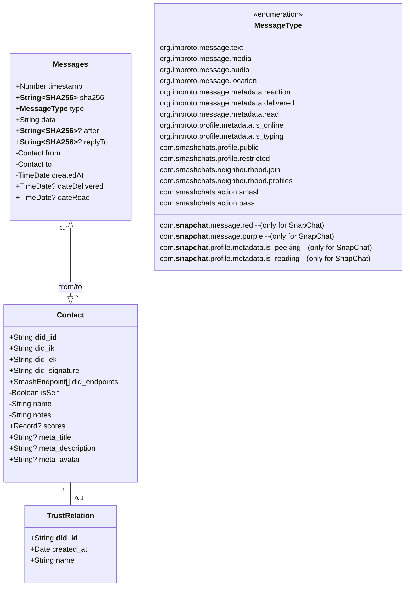

# smashchats

This is an [Expo](https://expo.dev) project created with [`create-expo-app`](https://www.npmjs.com/package/create-expo-app).

## Get started

1. Install dependencies

    ```bash
    npm install
    ```

2. Start the app

    ```bash
     npx expo start
     npx expo run:ios
    ```

## DB

### DB architecture

> [!NOTE]  
> Public fields (prefixed with a `+`) and private fields (prefixed with a `-`) are not from a code point of view. Private fields are local information (i.e. not exposed to the outside world) or information that is not relevant to the network (generated locally). Public fields is data coming from the network / SmashPeer / SmashNeighbourhoodAdmin.



### DB development

Currently, the DB is developed using [Drizzle Studio](https://github.com/drizzle-team/drizzle-studio).

```bash
npx expo start
# shift + m
# choose `Open **expo-drizzle-studio-plugin**`
```

Or visit `http://<your-ip>:8081/_expo/plugins/expo-drizzle-studio-plugin`

After modifying the schema, you need to run `npx drizzle-kit generate` before running the app again.

## Releasing 

Follow this guide: https://docs.expo.dev/guides/local-app-production

### Releasing for Android

```bash
rm ./android/app/build/outputs/bundle/release/app-release.aab
cd android
./gradlew app:bundleRelease
cd -
open ./android/app/build/outputs/bundle/release/
```

This will have created `app-release.aab` in `android/app/build/outputs/bundle/release/` directory.

- [Create a new alpha/internal release](https://play.google.com/console/u/0/developers/9150193425219657230/app/4976355900096563201/tracks/4701103354613619379/create)

### Releasing for iOS

Open Xcode:

```bash
xed ios
```

- Select the target "SmashChats" and click on the play button.
- Menubar: Product > Archive
- Select "SmashChats" and click on "Distribute App"

### Fastlane

Follow [this guide](https://thecodingmachine.github.io/react-native-boilerplate/docs/BetaBuild/#installing-fastlane).

Prerequisites:

```bash
brew install ruby
sudo gem install fastlane -NV
```

## Building for production

https://docs.expo.dev/guides/local-app-production/

## Troubleshooting

```bash
adb -d logcat --pid=`adb -d shell pidof -s com.unstaticlabs.smashchats`
```
